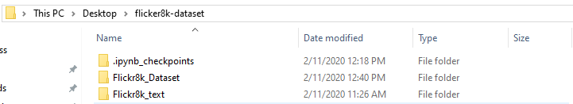
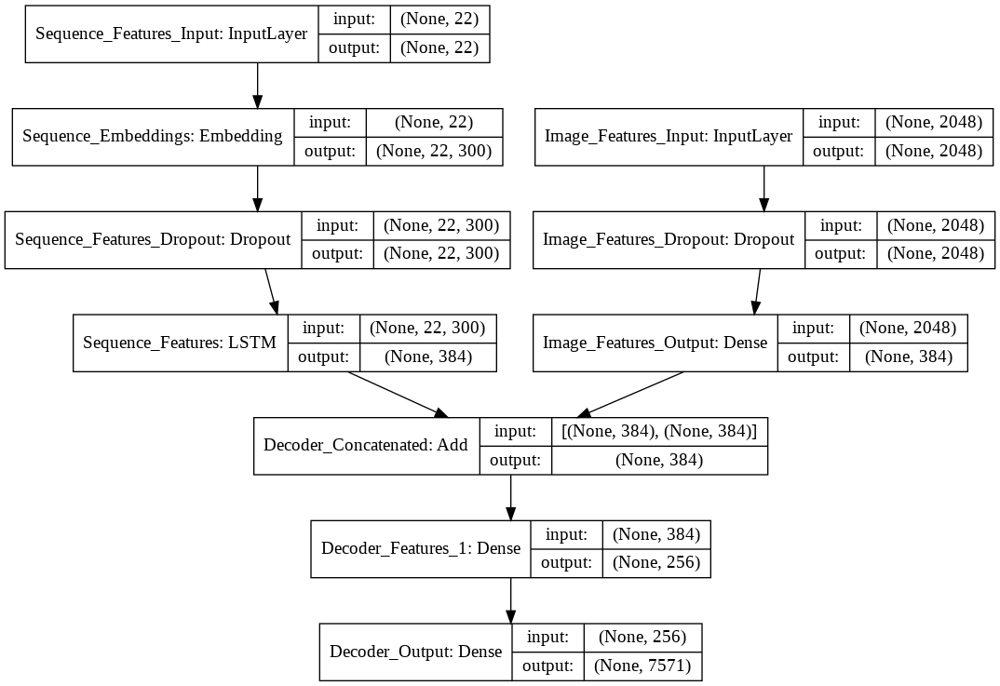
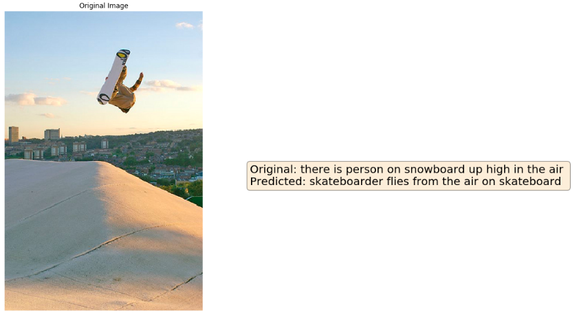
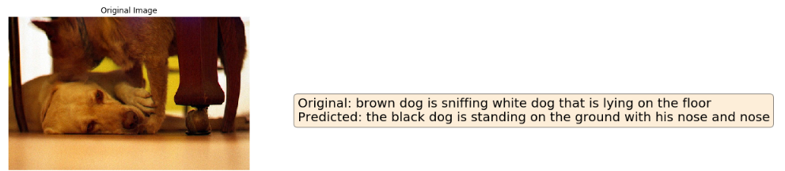
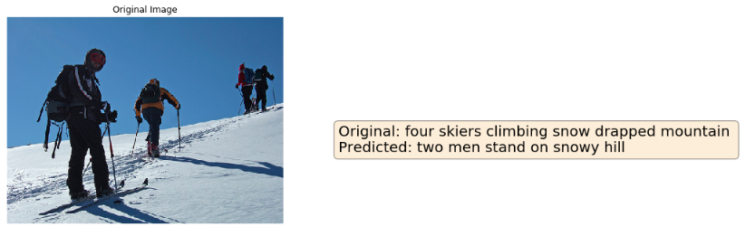
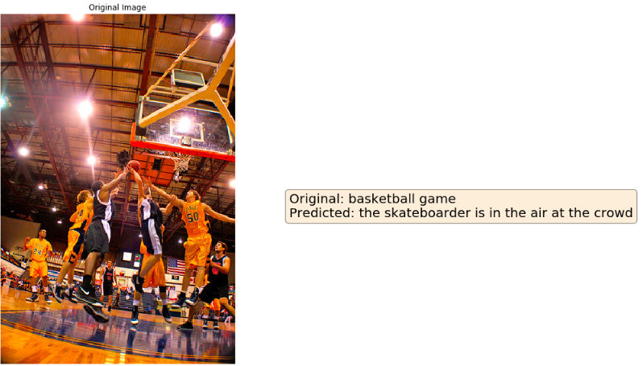

# Image Description Generator

## The Problem

Artificial Intelligence has asserted it's versatility in the industry and many people testify the amazing things which these networks can perform. One of these things is Image Captioning i.e. given an image, predict a sentence that describes what that image contains. Simply stated it generates a description given an image. There's a lot of things that go into making one such caption generator and thanks to the exhaustive research that's happening currently in this field, organizations and individuals have been extremely innovative and also generous enough to share ideas, concepts and implementations which help make this possible.


This project was the brainchild of Andrej Karpathy, Director of AI at Tesla, and Fei-Fei Li, professor at Stanford. While the latter spent a substantial amount of time getting and curating a dataset suitable for the needs of many for a slew of applications (called [ImageNet](http://www.image-net.org/)), the former with his work in AI came up with an implementation of deep learning architecture which combined Convolutional Neural Networks with Recurrent Neural Networks in order to accomplish this task.

## Potential Use Cases

With GPUs becoming increasingly accessible, it's feasible for this neural network to be used in a plethora of applications in everyday human life. Some of them are as follows

- **Computer aided visual understanding**: In simple terms, it means that a computer will be able to analyze and parse a scene in a similar way as humans (same would be a bit of stretch as per the status quo but we'll get there eventually. This is more on the lines of general intelligence where AI will possess human level understanding which Elon Musk is quite certain to happen is in the imminent couple of decades to come).
- **Fault Identification and Recommend Fixes**: Currently, service engineers who visit an engineering site (may it then be a construction site, an engine room, boiler chamber etc.) are supposed to look at the instrument, take a picture and describe the faults present therein and make a report of the same and provide suggestions to mend the equipment. Given enough training images and descriptions, a network can learn to immediately identify and recommend fixes. This could be a big step because on ships, planes etc. which use heavy machinery that's susceptible to failure and who carry a lot of cargo/people, quick fixes and immediate decisions are the need of the hour.
- **Aid to the visually challenged** - Computers could view the world by taking in images, generate captions for what's happening around and then communicate the same to visually challenged folks to let them know what's happening around.
- **Security & Surveillance systems** - Detection of an Emergency at a place isn't essentially an image captioning task. However, coming up with a description of the scene to communicate the same or to urgently take an action is where image captioning can help these systems. Also, at places like intersections where CCTVs are installed to monitor a car's speed, it would be more easy if the controller were informed "A Blue Volkswagen Polo XX-XXXX overspeeded to XX mph at XXX intersection XX seconds ago". There might certainly be other creative uses which I haven't explored but you get the general scope of how this idea can be milked to benefit humans.

## Solution Approach

The neural network architecture consists of a CNN and an RNN working in conjunction in order to achieve this task. The schematic for this is as shown below:


This is just one of the several architectures available for captioning images. The detailed explanation of this architecture can be found [here](https://arxiv.org/pdf/1708.02043.pdf). There's also another architecture called the inject architecture which is as follows. This is also termed as an encoder-decoder architecture since the weights of a pretrained network like imagenet first *encodes* the image into an n-dimensional vector and then the RNN uses this to decode the image into a sequence of words.


However, we can observe from the demonstrations in [this paper](https://arxiv.org/pdf/1708.02043.pdf) that the merge architecture mostly performs better than the inject architecture, that's why, let's resort to the merge-architecture for this task.

### Image CNN

An **image** can be converted into a **feature vector of fixed length** and this vector can be used at the start of a sequence generator architecture like RNN or LSTM to generate a sequence of words or caption for the image.


**The encoder** that I have used for the sake of this project is **ResNet50**. It is a **pretrained model** which was used to classify a million images into a thousand categories i.e. **ImageNet Dataset**. Since it's weights are tuned to identify a lot of things that commonly occur in nature, we can use this net effectively by **removing the top layer of 1000 neurons (meant for ImageNet classification) and instead adding a linear layer** with the number of neurons same as number of neurons that you're LSTM is going to output. 

### Sequence RNN

It consists of a series of LSTM (Long Short Term Memory) Cells which are used to recursively generate captions given an input image. These cells utilize the concept of recurrence and gates in order to remember information in past time steps. You can watch [this](https://www.youtube.com/watch?v=yCC09vCHzF8) or read [this](https://colah.github.io/posts/2015-08-Understanding-LSTMs/) to understand more about the same.

Eventually, the output from both encoder and decoder is merged and passed to a Dense Layer and finally an output layer which predicts the next word given our image and current sequence.

# About the Dataset

For the purpose of this problem, we'll be using a dataset called Flickr8K which can be found [here](https://www.kaggle.com/ming666/flicker8k-dataset). This dataset contains 8091 images and is structured as follows



The Flickr8k_text folder contains several text file of which we're interested in the following four

- **Flickr8k.token.txt**: This file has a list of all the image names and their associated captions. This is how the text file is structured.
  The structure of each line in the text file is as follows:

  > **image_name # caption_number caption**

  It's the name of the image followed by a hash symbol followed by the caption number followed by the actual caption. Every image has 5 captions associated with it.

- **Flickr_8k.trainImages.txt**: It is a list of all the images which are meant to be used for training the neural network that we defined above.

- **Flickr_8k.testImages.txt**: It is a list of all the images on which we can test our caption generating model

- **Flickr_8k.devImages.txt**: It is a list of all the images which we can use to validate our dataset. This will help understand if the model's under/overfitting and help keep track of the same.

Using these text files, we will have to do certain operations to get our data (both images and captions) into a form where we can feed it into a network and expect to get meaningful output. That's what we shall dive into next.

# Data Preparation

We need to process both images and captions separately before we can actually pass them into the network. Let's understand how to preprocess the two of them separately.

## Images

There's a lot we can do with images as a part of preprocessing step. We can augment images by changing their *shape, color, brightness, size, orientation, perspective* and you name it, there's a way to do it. But I wouldn't resort to those methods here in the interest of time and computational complexity. I don't have a GPU enabled system and I am using Google Colab to train this network. I haven't got the capacity of training my network for many epochs over long hours, but if you're interested in knowing an easy way out, you may look [here](https://pytorch.org/docs/stable/torchvision/transforms.html) to get an idea of the transforms and understand them thoroughly.

In this example the only transform that we will resort to is to resize our images to a $224 \times 224$ image with three color channels because that's how the image CNN network i.e. Resnet50 expects it's input to be. 

## Captions

As we saw above, every image has a list of five captions associated with it. We will have to read the captions from this directory and store it into a dictionary with the name of the file as key and a list of the captions associated with it as the value. Python's inbuilt `defaultdict()` from collections package will come in handy to accomplish this task. 

### Reading captions

Initially, we'll store all the captions in a collection such as a list since we want to process it beforehand.

```python
# Read all the captions into a list "captions"
# The structure of which will be like img_name#cap_number caption
captions = []
with open(tokens, 'r') as op:
  captions = op.readlines()
```

### Cleaning Captions

Convert all caption words to lowercase. We do not care for casing here. A lowercase **a** and an uppercase **A** are the same semantically for the sake of this task.

Punctuations don't mean anything. The descriptions are supposed to be short and objective in nature. Punctuations do not add any value in that aspect since they're used to convey other lingual information like pauses or emotions or tone which is out of scope of this task.

We would also assume here that objective words which convey meaning have at least two letters in their words. The only two one letter words are A and I which aren't important (Since they generally convey a subjective tone). So, remove them from our captions.

Eventually, save these captions in a text form in the format

> **\<image_name\> \<caption\>**

This will then become a one-time process which need not be repeated over and again.

```python
def clean_caption(caption):
  '''
  Given a caption, convert it to lowercase and remove all the punctuation marks
  from the same. Also checks if the word is a legit word i.e. only contains alphabets
  '''
  all_marks = r'[' + ''.join(['\\' + i for i in string.punctuation]) + ']' 
  caption = caption.lower() 
  caption = re.sub(all_marks, '', caption)  
  caption = ' '.join([i for i in caption.split(' ') if (i.isalpha() and len(i) > 1)])
  return caption
```

```python
captions = [re.sub('\t', ' ', i) for i in captions]
captions = [re.sub('\n', ' ', i) for i in captions]
all_caps = []                                                                  
just_caps = []                                                                 

for item in captions:
  key = re.findall(r'(.+)#\d', item)[0]                                        
  caption = re.findall(r'.+#\d (.+)', item)[0]                                 
  caption = clean_caption(caption)                                             
  just_caps.append(caption)                                                    
  all_caps.append(f"{key} {caption}")                                          

# Write cleaned descriptions as a mapping between image and caption to a file
with open("cleaned_descriptions.txt", "w") as op:
  op.write("\n".join(all_caps))

# Create a vocabulary from the specified words
vocab = set(" ".join(just_caps).split(" "))
```

### Determining an appropriate Caption Length

The architecture of neural network layers is such that the number of neurons in each layer is fixed. But if we look at the length of captions, we can see that they're all not the same. Some of them are very short and some of them are very long while most of them are medium sized with a length of almost 10 words. We need to fix a length in order to pass it as an input to our network. This can be done by looking at a histogram of the lengths of all the available captions. 


Once we've decided the *threshold for the length of a caption*, then we will have to act upon it by

- Reducing length of captions which exceed that length by truncating them to be *threshold* words long.
- Padding the captions which are short of the *threshold* length with zeros.

In addition to this, as seen in the image above, we need to add start and end tokens at the beginning and end of the sentence in order for the network to learn to predict captions of reasonable lengths. If that's not done, then the captions might go on and on which is undesirable. The start token is a special token that would be predicted at the start of every caption and the end token would indicate the end of a caption i.e. stop predicting more words. Despite having an end token, we will also keep an additional constraint of  the maximum length of token. Since we have used a `threshold` length caption for training it only makes sense to generate captions of the same length or lower.

### Determining appropriate vocab size

Every word in the caption is going to be represented as an `embed_size` dimensional vector (assume n-dimensional for simplicity, more on this later). These vectors' weights will be learned in this process. The more the words, the more the number of representations to be learned.

Also, these vectors will be learned well only when they appear a certain number of times in the vocabulary. Why so? In order for backpropagation to work it's magic, there needs to be a forward propagation with these words/vectors. If they don't appear enough, their weight/coefficient values will not be tuned or learned appropriately. Either that or we'll have to run an insanely large number of epochs. But with that we risk the probability of overfitting a model. So, it's better to keep a minimum occurrence threshold for the words that occur in our captions. 

We will keep it to a minimum of 2 occurrences i.e. a word must have appeared at least twice in the entire descriptions' set to count it as a valid word in the vocabulary. Else it will be counted as an **oov - out of vocabulary ** word and all such words will be represented only with one unique identifier (OTHER in our case).

### Mapping words to integer indices

Neural networks don't understand letters and words and strings. All they do is map a set of number inputs to a set of number outputs. So, we have to convert our list of words into list of numbered inputs. We can do this by instantiating a Tokenizer object in keras which takes in a list of all the captions/descriptions, crunches them and makes several dictionaries

- word_counts: An Ordered Dictionary which maps a word to it's number of occurrences in the corpus.
- word_index: A dictionary which maps every unique word in the corpus to an integer index.
- index_word: A dictionary which maps the integer index in dict above to it's respective word.

In order to only include words which have occurred a certain minimum threshold number of times, we will have to use a tokenizer to first fit the entire description, use the word_counts attribute to figure out the total number of words that are satisfying the threshold criterion and redefine the tokenizer.

```python
def most_common_words(description, threshold):
  '''
  Given a description dictionary and a threshold value,
  identifies the top n words which occur at least threshold
  number of times in the vocabulary of description texts.
  '''
  caps = []
  for v in description.values(): 
    caps.extend(v)

  tk = Tokenizer() 
  tk.fit_on_texts(caps)
  count_dict = dict(tk.word_counts)
  most_common = len([i for i in count_dict if count_dict[i] >= threshold]) 
  return most_common 

def get_tokenizer(description, vocab_threshold):
  '''
  Given a dictionary that maps image ---> List of captions, 
  extracts all the captions and the words therein. Creates a keras tokenizer  
  which maps every word in every caption in this corpus to a unique integer
  identifier. Also only words which have occured more than or equal to 
  vocab_threshold number of times are included in the vocabulary

  It returns the tokenizer thus formed and the maximum length
  from amongst all the captions encountered in the corpus.
  '''
  caps = []
  for key, val in description.items():
    caps.extend(val) 
  max_len = max([len(i.split(' ')) for i in caps]) 
  n_most_common = most_common_words(description, vocab_threshold)
  tk = Tokenizer(num_words = n_most_common, oov_token = "OTHER")    
  tk.fit_on_texts(caps)                                             
  return (tk, max_len)                        
```

# Defining a Custom Generator to load data

Now that both the images and captions are ready and processed, we can proceed with defining a loader object to iteratively get batches of the same and work for it. 

**Why load data in batches? Why not load all data and process it simultaneously?**

Well, loading and storing all our data on the disk idle while our network only works with a single batch of data at a time doesn't sound efficient. Also, once a batch is used for training and loss calculation, there's no use of retaining that batch because no computation is going to be done on that batch at a later point in the future. In order to make our learning process more efficient and reduce space utilization which is otherwise redundant we can utilize the generator data-structure in python that helps load data iteratively in batches.

We will take an input image and it's corresponding 5 captions and generate a batch i.e. we will repeat the process of creating input-output pairs for one-image caption pair five times. So, effectively, every time the batch-size might change depending on the length of the five captions but we can say that we're working with at least five image, sequence, output pairs and at most $5 \times (max_length+1)$ pairs.

# The Model Architecture

**Architecture**:

The solution model architecture is implemented as below. The schematic was obtained by using the `plot_model` function from `keras.utils` package.



- The image features pipeline consists of **an input, a dropout and a dense layer**. The dropout layer will help to regularize and the dense layer will convert the substantially high 2048-dimensional output as returned by the penultimate layer of ResNet50 into a modest 256-dimensional output.
- The sequence features pipeline consists of an input layer, embedding layer, dropout layer and an LSTM layer. It's important to note here that ***LSTM output*** dimension and ***Image Features Output Dense Layer*** dimension must be the same. Because they'll both be merged and passed on to the further architecture.
- After processing sequence and image separately, we then merge them and pass it through another dense layer and activate the outputs with ReLU before finally getting a probability distribution of the words in our vocabulary with a softmax activated dense layer.

# Training the model

Once we have defined the model as shown above, we need to train it using the data present in trainset and simultaneously evaluate it on the validation set to ensure that the model is performing well and isn't actually over-fitting. There are several decisions that we need to make in order to train the model.

## Optimization Algorithm

We can resort to several optimization algorithms in order to train our model. Amongst the contenders are SGD, Adam, Adagrad, AdaDelta, AdaMax. While all of these are good choices for certain, as cited in [this paper](https://arxiv.org/pdf/1708.02043.pdf), they obtained the best results with Adam.

Also, to cite [this source](https://arxiv.org/abs/1412.6980v8)

> Empirical results demonstrate that Adam works well in practice and compares favorably to other stochastic optimization methods.

So, we will choose to go with Adam.

## Loss Function 

The loss function we select should possess the following properties

- Robustness - The loss function should not explode in case of outliers i.e. the values of gradients should not escalate insanely when dealing with potential outliers or abnormal points.
- Sparsity - Should use as little data as possible
- Non-ambiguous - Multiple co-efficient values shouldn't give same error i.e. two sets of weights shouldn't give same error else backprop will not work.

Commonly, cross-entropy loss satisfies the above criteria and is therefore a decent loss function for classification problems. Although our problem's a sequence output problem, at every time-step, it is spitting out a probability distribution of words from which we are picking the one having max probability. So, fundamentally at a step level, it is still a classification problem.

## Training Hyper-parameters

- *Learning Rate* - It is one of the most important hyper-parameters that'll decide the course of your learning. It should neither be too high in which case your model will misbehave and the loss will escalate nor too low in which case your model will take forever to reach the optimal point. It should be just perfect but in practise that's difficult to determine.
  For that reason, we can either experiment with a constant learning rate or use a decay where with every passing epoch, the learning rate reduces by some amount which can be linear or stepped.

  ```
  epochs = 10
  lr_ = 0.01
  decay_rate = lr_/(epochs)	
  optim = optimizers.SGD(lr = lr_, decay = decay_rate)
  ```

  In the above code, at the beginning of training, the learning rate will be 0.01 and it will decrease by a step of $\frac{0.01}{10} = 0.001$ with every epoch until it reaches 0.001 at the last epoch. 

  I tried training both ways but it seems that the model performs well with a constant learning rate of 0.01. It starts to overfit after first 7-8 epochs but that's the best I could obtain for this dataset with the architecture defined above.

  

- *Number of Epochs*: There's no way to know for sure how many epochs will be needed for training a deep learning model. We only know that as long as both train loss and validation loss are on a decline, we need to continue training the model as it has scope to learn more and improve. In the above case, we can observe that after around the 10th epoch, our model went haywire and started overfitting. So, this is a good cue to stop training. 

  Although we trained our model further and tried to see if it could improve which didn't happen, we saved the model weights at each and every step of the way. We can therefore say that the model which is trained for 10 epochs is the best and must be deployed to predict on test images. 

# Model Evaluation

After having trained the model, now comes the time to test how good our model is. There are several ways we could do this. The simplest one is take an image, generate a caption and check whether what is output/predicted makes any sense or not. Let's try doing this on images from our test folder and see if it's relevant/related to the original caption.



The model seems to be predicting well on this image. Except the grammar it has grasped the action and the  content of the image right.



In the above image, it has identified one dog which is standing and it's already hard to distinguish if it's brown or black colored owing to the lighting conditions. However the model couldn't identify the second dog.



In this image, it has identified the background properly but it only picked up two men who seem to stand still at the top of the mountain. It is yet to learn to identify things in foreground properly.



In this image, it seems that the model performed horribly which is true. But it could be attributed to the fact that our training data has a lot of skateboarder images who are most of the times flying or airborne. Also, the fact that it could recognize there are several people and use the word crowd is commendable.

## BLEU Score Evaluation

BLEU is short for **Bilingual Evaluation Understudy**. It is an algorithm which crudely compares the quality of machine output and human output in textual problems.

On a high level, it takes n-grams of a human generated caption and corresponding n-grams of a machine genrated caption and looks for common elements. The n-grams are inclusive of unordered ones. The more the common elements between the corresponding n-grams of the two captions, the better the caption quality. 

I said it's a crude comparison because it gives relies on unordered sets thereby making a weak case for the sentences where the occurrence of words in a particular order can change the meaning of the sentence. Since our system of caption generation is quite simple and doesn't involve such intricacies, this method is a decent one to gauge our model's performance.

**BLEU-1: 0.402845** 

**BLEU-2: 0.232844** 

**BLEU-3: 0.163721** 

**BLEU-4: 0.075145**

These are the BLEU scores that we obtained for our model which was trained using Google Colab for 10 epochs with a learning rate of 0.01 with a merge-architecture model that used GloVe vector embeddings (trainable though) of 300 dimensions. Although this is not the state of the art, it's presumably decent given the system and data limitations.

# References

This is a list of all the websites/video links which I referred while implementing a neural image caption generator.

1. [Show and Tell: A Neural Image Caption Generator](https://arxiv.org/pdf/1411.4555.pdf)

2. [What is the Role of Recurrent Neural Networks RNNs in an Image Caption Generator](https://arxiv.org/pdf/1708.02043.pdf)

3. [Flickr8k_Dataset](https://www.kaggle.com/ming666/flicker8k-dataset/data#)

4. [How to Develop a Deep Learning Photo Caption Generator from Scratch](https://machinelearningmastery.com/develop-a-deep-learning-caption-generation-model-in-python/)

5. [CS231n Winter 2016: Lecture 10: Recurrent Neural Networks, Image Captioning, LSTM](https://www.youtube.com/watch?v=yCC09vCHzF8)

6. [Understanding LSTM Networks](https://colah.github.io/posts/2015-08-Understanding-LSTMs/)

7. [ImageNet Dataset - What is it?](https://en.wikipedia.org/wiki/ImageNet)

8. [Residual Network ResNet - What is it?](https://towardsdatascience.com/an-overview-of-resnet-and-its-variants-5281e2f56035)

9. [Generators in python for loading data](https://jeffknupp.com/blog/2013/04/07/improve-your-python-yield-and-generators-explained/)

10. [Glove Vector Embeddings](https://nlp.stanford.edu/projects/glove/)

If you wish to see the notebooks that I have originally written in Google Colab, refer [here](https://colab.research.google.com/drive/1DFhh2Zin2h_BEmW6Nb-Io-iPmpYeNswQ) for the notebook that trains and evaluates the image captioning model and [here](https://colab.research.google.com/drive/1O-sr-9BAjAOU2NSplbAEjedIf8JFPYhu) for notebook that generates a prediction.
